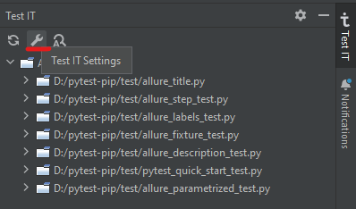
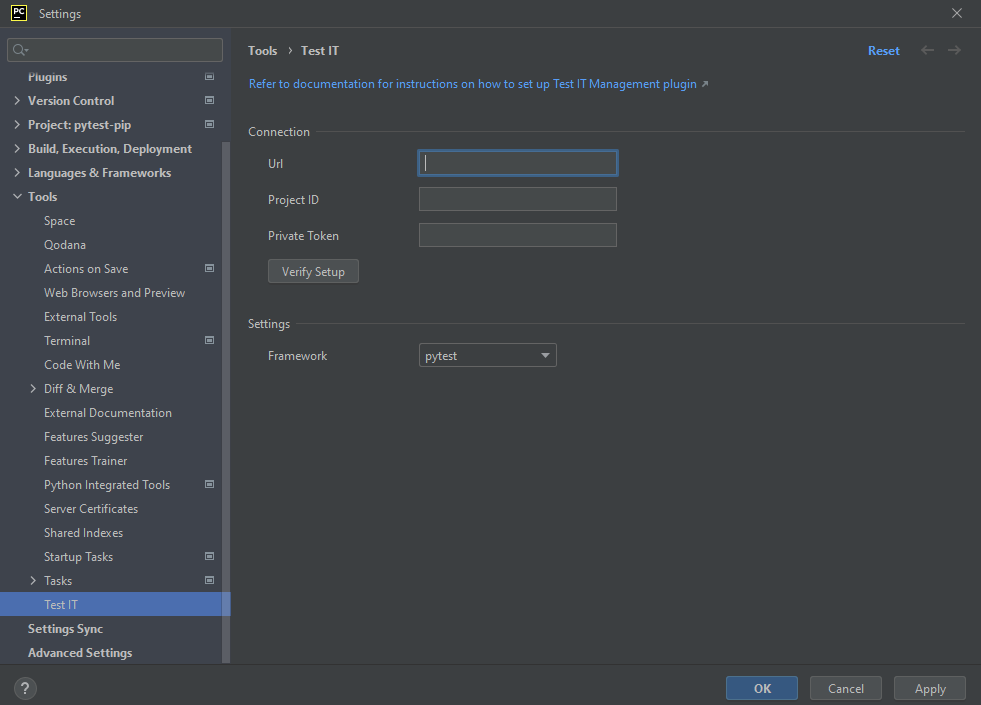
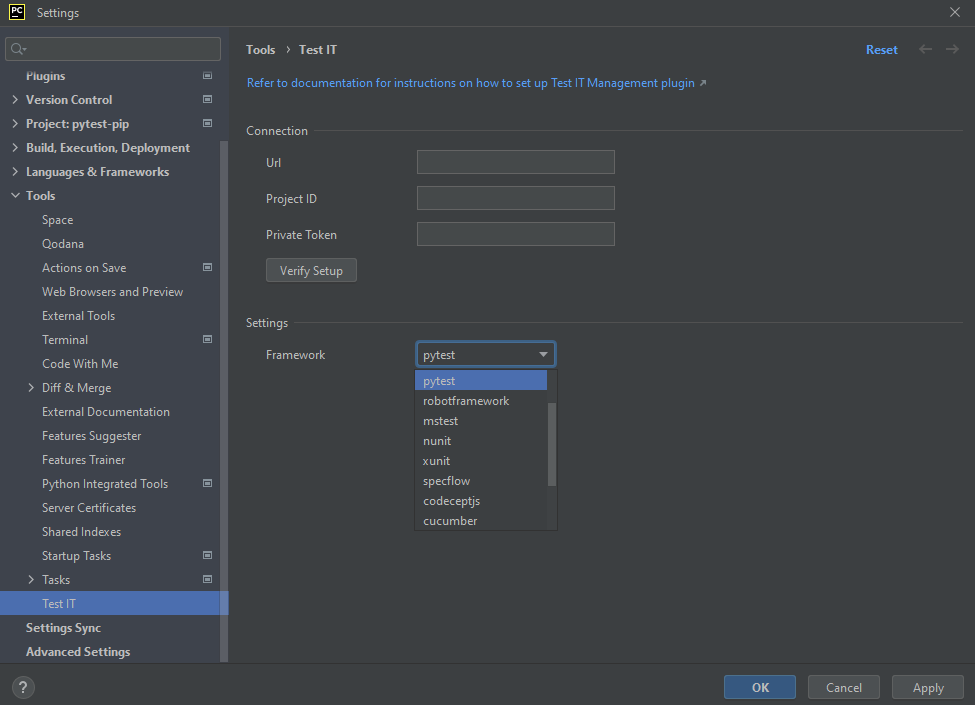
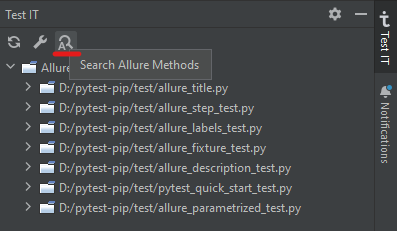
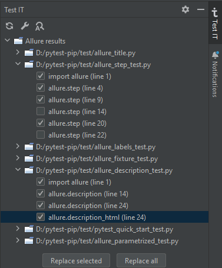
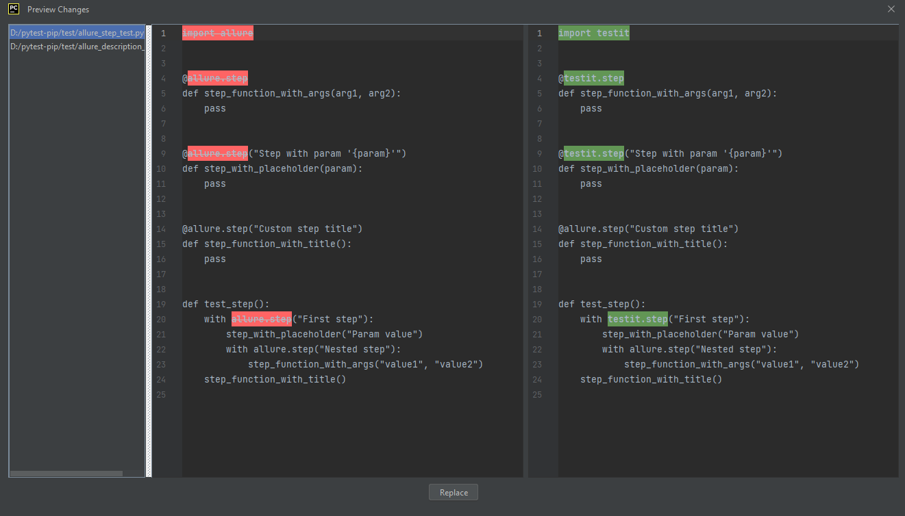

# Search and replace Allure methods

## Supported

- Pytest
- Behave
- RobotFramework

## Getting Started

### Configuration

1. **Click** on the "**Test IT Settings**" button and set up the connection between TMS and your IDE:

    

2. **Set up** the connection between TMS and your IDE and **click** on the "**Verify Setup**" button:

   
   - URL — The URL of your TMS system
   - Project ID — The ID of the TMS project
   - Private token — private API token for TMS

3. **Select** a test **framework** from the menu (Currently supported by Pytest and Behave):

   

4. Click on the "Apply" button

### Usage

1. **Click** on the "**Search Allure Methods**" button (If Allure is found in the project, the form will be filled with data):

   

2. **Select** the **checkboxes** of the Allure methods and **click** on the "Replace selected" button **OR** click on the "Replace all" button:

   

3. **View** the "**Preview changes**" menu to **avoid unnecessary replacement**:

    

4. **Confirm** the replacement for **all selected files**

## Links

If you have suggestions for adding or removing projects, feel free to [open an issue](https://github.com/testit-tms/testit-management/issues/new) to discuss it, or create a direct pull request after you edit the *README.md* file with necessary changes.
